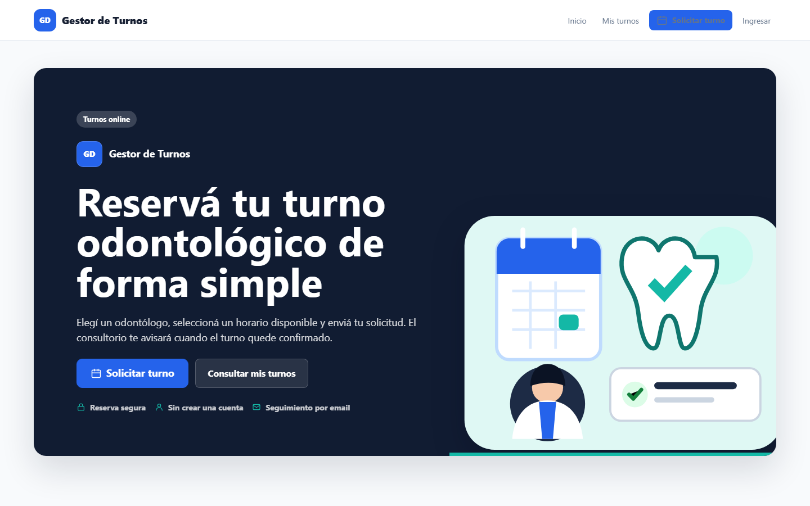
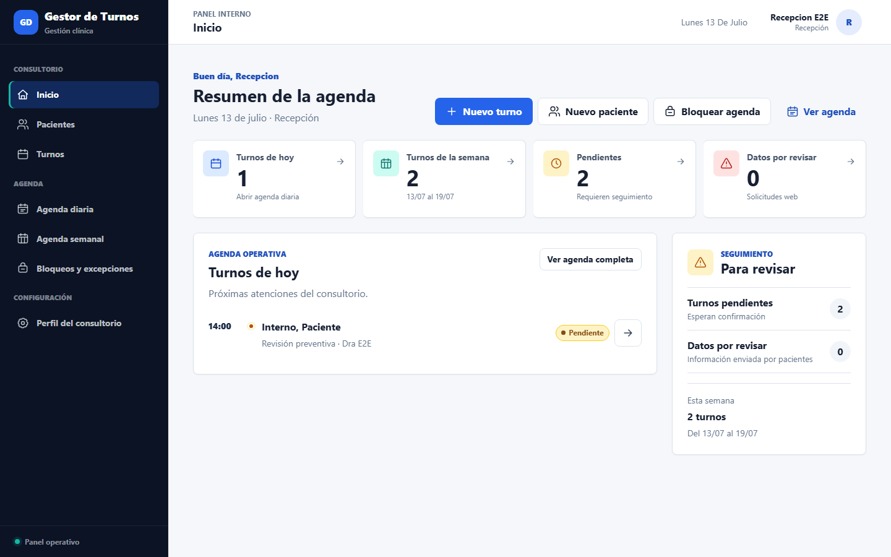
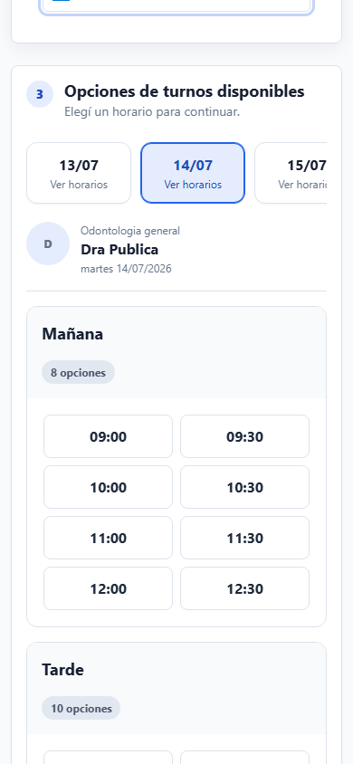
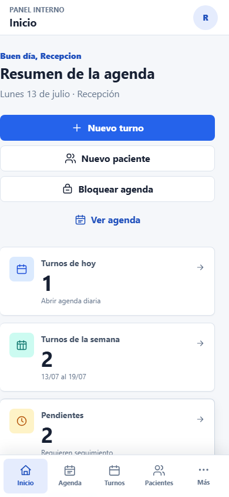

# Gestor de Turnos Odontológico

[](https://github.com/Lukillas09/gestor-turnos-odontologia/actions/workflows/ci.yml)

Aplicación web en Django para gestionar la agenda de un consultorio odontológico, con panel interno para el equipo del consultorio e interfaz pública para pacientes.

El proyecto busca resolver un flujo real de trabajo: cargar pacientes, administrar turnos, validar disponibilidad, confirmar solicitudes públicas, mantener historia clínica, adjuntar archivos clínicos, sincronizar con Google Calendar y enviar notificaciones por email.

## Interfaz Visual V2

La experiencia pública y el panel interno comparten un sistema visual responsive, accesible y sin frameworks frontend. Las capturas usan datos ficticios generados por los tests E2E.

| Reserva pública | Panel interno |
| --- | --- |
|  |  |
|  |  |

Las referencias completas están en [`docs/screenshots/`](docs/screenshots/). El sistema de diseño y las decisiones de experiencia se documentan en [Design system](docs/design-system.md) e [Interfaz UI/UX V2](docs/ui-ux-v2.md).

## Estado Actual

El sistema ya cuenta con una base funcional para uso controlado en staging:

- Landing pública para pacientes en `/`.
- Solicitud pública de turnos en `/turnos/solicitar/`.
- Autogestión pública de turnos en `/turnos/mis-turnos/` con acceso por código OTP enviado al email registrado.
- Login interno separado en `/cuentas/login/`.
- Dashboard interno en `/inicio/`.
- Perfil del consultorio editable desde `/configuracion/consultorio/` para nombre, logo, contacto, textos públicos, color principal y reglas de reserva pública.
- Gestión visual de pacientes, turnos, agenda diaria/semanal e historia clínica.
- Excepciones operativas de agenda en `/turnos/excepciones/` para bloquear feriados, vacaciones, capacitaciones, ausencias y cierres sin borrar turnos existentes.
- Roles internos con grupos de Django: `Recepcionista`, `Odontologo` y `Administrador`.
- Asociación paciente-odontólogo y derivación de pacientes.
- Autorizacion por objeto para pacientes, historias, adjuntos, odontogramas y turnos internos: conocer un ID no concede acceso.
- Ficha odontológica combinada con datos personales, administrativos y clínicos.
- Historia clínica con borradores versionados, finalización inmutable, folios por paciente,
  enmiendas posteriores, sellos de integridad y adjuntos con SHA-256. El odontograma queda
  desactivado como implementación futura.
- Indicaciones postoperatorias con plantillas versionadas, borrador profesional, PDF privado,
  sello de integridad, entrega al email verificado, anulación y reemplazo. El módulo queda
  desactivado por defecto hasta completar la validación del entorno.
- Turnos con estados `Pendiente`, `Confirmado` y `Cancelado`.
- Turnos internos confirmados automáticamente.
- Solicitudes públicas que crean turnos `Pendiente` con duración inicial de 30 minutos y quedan visibles directamente en Turnos y Agenda.
- Las solicitudes públicas conservan una fotografía independiente de los datos enviados como auditoría y no actualizan automáticamente pacientes existentes.
- Revisión integrada en el detalle/confirmación del turno para conservar datos, aplicar campos seleccionados, validar pacientes nuevos o rechazar la solicitud.
- Alertas administrativas separadas para solicitudes públicas excepcionales que no generan turno, por ejemplo pacientes archivados.
- Confirmación de turnos pendientes con duración real, revisión pública atómica cuando corresponde y validación de superposición.
- Emails transaccionales para solicitud, confirmación, cancelación, reprogramación y recordatorios.
- Google Calendar OAuth por odontólogo y sincronización de eventos.
- Supabase PostgreSQL como base de datos para deploy.
- Supabase Storage privado para adjuntos clínicos.
- Deploy preparado para Railway con Gunicorn, WhiteNoise y scripts de build/start/release.
- Tests automatizados para dominio, permisos, turnos, agenda, emails, Google Calendar, historia clínica e interfaz pública. El módulo de odontograma conserva pruebas propias para una reactivación controlada.

### Estado Del Odontograma

El código del odontograma se conserva en el repositorio como una implementación experimental y futura. La app `odontogramas`, sus modelos, migraciones, templates, assets y tests no fueron eliminados, pero la funcionalidad está desactivada por defecto mediante `ODONTOGRAMA_FEATURE_ENABLED=False`.

Mientras ese flag permanezca apagado, el odontograma no se muestra en las pantallas clínicas, no se integra al alta de entradas de historia clínica y las URLs directas del módulo responden como no disponibles. Para retomarlo más adelante se debe completar la validación funcional/UX y activarlo explícitamente por configuración.

## Stack Tecnológico

| Área | Tecnología |
| --- | --- |
| Backend | Python 3.13, Django 6.0.4 |
| Base local | SQLite si `DATABASE_URL` está vacío |
| Base deploy | Supabase PostgreSQL mediante `DATABASE_URL` |
| Archivos clínicos | Supabase Storage privado o filesystem local |
| Email | Consola, SMTP o backend HTTP propio para Resend/Brevo |
| Calendario | Google Calendar API con OAuth por odontólogo |
| Deploy | Railway |
| Servidor WSGI | Gunicorn |
| Estáticos | WhiteNoise + `collectstatic` |
| Tests | Django TestCase |

## Arquitectura General

El proyecto está organizado por apps Django con responsabilidades separadas:

| App | Responsabilidad |
| --- | --- |
| `config` | Settings, URLs globales, base de datos, email, storage y configuración de entorno. |
| `consultorio` | Perfil singleton del consultorio: identidad visual, logo, contacto, textos públicos, color de marca, datos usados en emails y reglas de reserva pública. |
| `usuarios` | Login interno, dashboard, perfil de usuario, roles, permisos y mixins. |
| `pacientes` | Datos personales, ficha odontológica, asociación con odontólogos, derivación y borrado seguro. |
| `turnos` | Odontólogos, disponibilidad, turnos, excepciones operativas de agenda, solicitud pública, emails, recordatorios y Google Calendar. |
| `historias` | Asientos clínicos versionados, folios, enmiendas, integridad HMAC, adjuntos privados, exportación y auditoría. |
| `indicaciones` | Documentos postoperatorios inmutables, plantillas versionadas, PDF privado, email, reintentos, anulación y auditoría clínica. |
| `odontogramas` | Implementación experimental del odontograma FDI, conservada detrás del feature flag `ODONTOGRAMA_FEATURE_ENABLED` para retomarla en una etapa futura. |

Documentación técnica principal:

- [Arquitectura](docs/arquitectura.md)
- [Configuración](docs/configuracion.md)
- [Historia clínica versionada e inmutable](docs/historia_clinica_inmutable.md)
- [Indicaciones postoperatorias](docs/indicaciones_postoperatorias.md)
- [Flujo de turnos](docs/flujo-turnos.md)
- [Deploy en Railway usando Supabase](docs/deploy.md)
- [Recordatorios automáticos](docs/recordatorios.md)
- [Supabase Storage](docs/supabase_storage.md)
- [Backups](docs/backups.md)
- [Email por API HTTP](docs/email_api.md)
- [Seguridad antes de producción](docs/seguridad_produccion.md)
- [Rendimiento y fluidez](docs/rendimiento_y_fluidez.md)
- [Sistema de diseño](docs/design-system.md)
- [Interfaz UI/UX V2](docs/ui-ux-v2.md)

## Estructura Del Repositorio

```text
gestor-turnos-odontologia/
├── README.md
├── LICENSE
├── requirements.txt
├── Procfile
├── railway.json
├── .env.example
├── .env.railway-supabase.example
├── .github/
│   └── workflows/
│       └── staging_recordatorios.yml
├── docs/
├── scripts/
│   ├── build.sh
│   ├── release.sh
│   ├── start.sh
│   ├── recordatorios.sh
│   ├── backup_postgresql.sh
│   ├── backup_postgresql_docker.ps1
│   ├── probar_restore_postgresql_docker.ps1
│   └── backup_storage_historias.ps1
└── app/
    ├── manage.py
    ├── config/
    ├── usuarios/
    ├── pacientes/
    ├── turnos/
    ├── historias/
    ├── indicaciones/
    ├── odontogramas/
    └── templates/
```

## Instalación Local

Desde la carpeta del repositorio:

```powershell
python -m venv .venv
.\.venv\Scripts\Activate.ps1
pip install -r requirements.txt
Copy-Item .env.example .env
cd app
python manage.py migrate
python manage.py createsuperuser
python manage.py runserver
```

URLs locales principales:

```text
http://127.0.0.1:8000/                       # landing pública para pacientes
http://127.0.0.1:8000/turnos/solicitar/       # solicitud pública
http://127.0.0.1:8000/turnos/mis-turnos/solicitar-acceso/  # acceso público por OTP
http://127.0.0.1:8000/cuentas/login/          # login interno
http://127.0.0.1:8000/inicio/                 # dashboard interno
http://127.0.0.1:8000/admin/                  # Django Admin
```

## Variables de Entorno

El proyecto carga `.env` desde la raíz del repo y desde `app/.env` si existe. `.env` no se versiona.

Plantillas:

- `.env.example`: desarrollo local.
- `.env.railway-supabase.example`: Railway + Supabase.

Variables principales:

| Grupo | Variables |
| --- | --- |
| Django | `DJANGO_SECRET_KEY`, `DJANGO_DEBUG`, `DJANGO_ALLOWED_HOSTS`, `DJANGO_CSRF_TRUSTED_ORIGINS`, `DJANGO_LOG_LEVEL` |
| Feature flags | `ODONTOGRAMA_FEATURE_ENABLED`, `INDICACIONES_POSTOPERATORIAS_ENABLED`, `DATOS_CLINICOS_COMPARTIDOS_ENTRE_ODONTOLOGOS`, `ACCESO_CLINICO_EMERGENCIA_SECONDS` |
| Integridad clínica | `CLINICAL_INTEGRITY_ENABLED`, `CLINICAL_INTEGRITY_HMAC_KEY` |
| Seguridad pública de turnos | `REDIS_URL`, `TURNOS_PUBLIC_REDIS_REQUIRED`, `TURNOS_PUBLIC_ACCESS_REQUEST_LIMIT`, `TURNOS_PUBLIC_ACCESS_REQUEST_WINDOW_SECONDS`, `TURNOS_PUBLIC_OTP_ATTEMPTS`, `TURNOS_PUBLIC_OTP_SECONDS`, `TURNOS_PUBLIC_SESSION_SECONDS`, `TURNOS_PUBLIC_RESEND_SECONDS`, `TURNOS_PUBLIC_RESEND_LIMIT`, `TURNOS_PUBLIC_RESEND_WINDOW_SECONDS`, `TURNOS_PUBLIC_ACTION_TOKEN_SECONDS`, `TURNOS_PUBLIC_ACTION_LIMIT`, `TURNOS_PUBLIC_ACTION_WINDOW_SECONDS`, `TURNOS_PUBLIC_BOOKING_IP_LIMIT`, `TURNOS_PUBLIC_BOOKING_IP_WINDOW_SECONDS`, `TURNOS_PUBLIC_BOOKING_DNI_LIMIT`, `TURNOS_PUBLIC_BOOKING_DNI_WINDOW_SECONDS`, `TURNOS_PUBLIC_BOOKING_TURNSTILE_AFTER_ATTEMPTS`, `TURNOS_PUBLIC_BOOKING_MAX_PENDING_PER_DNI`, `TURNOS_PUBLIC_BOOKING_IDEMPOTENCY_SECONDS`, `TURNOS_PUBLIC_BOOKING_DUPLICATE_WINDOW_SECONDS`, `TURNOS_PUBLIC_BOOKING_NEARBY_DAYS_LIMIT`, `TURNOS_PUBLIC_BOOKING_HORARIOS_CACHE_SECONDS`, `TURNSTILE_ENABLED`, `TURNSTILE_SITE_KEY`, `TURNSTILE_SECRET_KEY` |
| Cifrado OAuth | `OAUTH_TOKEN_ENCRYPTION_KEY` |
| Seguridad HTTPS | `DJANGO_SECURE_SSL_REDIRECT`, `DJANGO_SESSION_COOKIE_SECURE`, `DJANGO_CSRF_COOKIE_SECURE`, `DJANGO_SECURE_PROXY_SSL_HEADER`, `DJANGO_SECURE_HSTS_SECONDS`, `DJANGO_SECURE_HSTS_INCLUDE_SUBDOMAINS`, `DJANGO_SECURE_HSTS_PRELOAD` |
| Base de datos | `DATABASE_URL` |
| Email | `EMAIL_BACKEND`, `EMAIL_HOST`, `EMAIL_PORT`, `EMAIL_HOST_USER`, `EMAIL_HOST_PASSWORD`, `EMAIL_USE_TLS`, `EMAIL_USE_SSL`, `EMAIL_TIMEOUT`, `DEFAULT_FROM_EMAIL`, `EMAIL_API_PROVIDER`, `EMAIL_API_KEY`, `EMAIL_API_URL` |
| Recordatorios | `TURNOS_RECORDATORIO_HORAS` |
| Google Calendar | `GOOGLE_CALENDAR_CLIENT_ID`, `GOOGLE_CALENDAR_CLIENT_SECRET`, `GOOGLE_CALENDAR_CLIENT_SECRETS_FILE`, `GOOGLE_CALENDAR_REDIRECT_URI`, `GOOGLE_CALENDAR_SCOPES` |
| Storage clínico | `MEDIA_STORAGE_BACKEND`, `PRIVATE_CLINICAL_STORAGE_BACKEND`, `INDICACIONES_PDF_MAX_BYTES`, `SUPABASE_STORAGE_URL`, `SUPABASE_STORAGE_BUCKET`, `SUPABASE_STORAGE_SERVICE_ROLE_KEY`, `SUPABASE_STORAGE_TIMEOUT`, `SUPABASE_STORAGE_CACHE_CONTROL`, `SUPABASE_STORAGE_SIGNED_URL_SECONDS` |
| Deploy | `WEB_CONCURRENCY` |

Detalle completo: [docs/configuracion.md](docs/configuracion.md).

## Flujos Principales

### Paciente Público

1. Ingresa a `/`.
2. Solicita turno desde `/turnos/solicitar/`.
3. Elige odontólogo, fecha y horario disponible.
4. Completa nombre, apellido, DNI obligatorio, teléfono, email y motivo opcional. El email es obligatorio para pacientes nuevos y para pacientes existentes que todavía no tienen email registrado.
5. El sistema aplica protecciones de creación: rate limit por IP y DNI hasheados, token de idempotencia, deduplicación exacta, máximo de pendientes por DNI y Turnstile progresivo si está habilitado.
6. El sistema valida ventana pública, anticipación mínima, disponibilidad, excepciones de agenda y superposición.
7. El sistema normaliza el DNI, crea un turno `Pendiente` con duración inicial de 30 minutos y guarda una `SolicitudTurnoPublica` con la fotografía de lo enviado.
8. Si el DNI ya pertenecía a un paciente, los datos principales no se modifican desde la web; el email propuesto queda en la solicitud pública y las diferencias se revisan al abrir/confirmar el turno pendiente.
9. Solicita acceso temporal desde `/turnos/mis-turnos/solicitar-acceso/`; si el DNI coincide con un paciente activo con email persistido, recibe un código OTP en ese contacto. Los emails propuestos desde la web no se usan para OTP hasta que un usuario interno los aplique explícitamente.
10. Puede cancelar turnos pendientes/confirmados.
11. Puede reprogramar solo turnos pendientes dentro de la ventana pública vigente.

### Equipo Interno

1. Ingresa por `/cuentas/login/`.
2. Ve un dashboard simple en `/inicio/`.
3. Gestiona pacientes, turnos y agenda según rol.
4. Confirma turnos pendientes eligiendo duración real.
5. Si el turno viene de una solicitud pública pendiente, revisa diferencias, valida pacientes nuevos o aplica campos seleccionados desde la misma pantalla de confirmación.
6. Reprograma o cancela turnos.
7. Atiende alertas administrativas sólo cuando una solicitud pública no generó turno.
8. Gestiona excepciones operativas de agenda según rol.
9. Configura el perfil del consultorio si tiene permisos de gestión.
10. Gestiona ficha odontológica, historia clínica y adjuntos clínicos.
11. Con el feature flag activo, el odontólogo emite indicaciones postoperatorias inmutables y puede anularlas o reemplazarlas sin borrar el original.
12. Cada odontólogo puede conectar su propia cuenta de Google Calendar.

Más detalle: [docs/flujo-turnos.md](docs/flujo-turnos.md).

## Reglas de Negocio de Turnos

- Estados válidos: `Pendiente`, `Confirmado`, `Cancelado`.
- Los turnos cancelados no bloquean disponibilidad.
- Los turnos pendientes y confirmados sí bloquean disponibilidad.
- Los turnos internos se crean confirmados automáticamente.
- Las solicitudes públicas se crean pendientes y duran 30 minutos inicialmente.
- Las reservas públicas visibles y reservables se limitan por configuración del consultorio: ventana en días, reserva el mismo día y anticipación mínima.
- Una solicitud pública nunca reemplaza por sí sola nombre, apellido, teléfono o email de un paciente existente.
- El POST final de solicitud pública está protegido contra automatización y duplicados con Redis/cache, idempotencia por formulario, límite por IP, límite por DNI y máximo de pendientes por DNI.
- Turnstile es progresivo y complementario; si está desactivado, los límites duros siguen aplicando.
- Los pacientes nuevos creados desde la web quedan con `origen_alta=solicitud_publica` y `estado_validacion_datos=pendiente`.
- La confirmación interna permite elegir duración real y, para solicitudes públicas pendientes, resolver la revisión de datos en el mismo flujo.
- Si la duración elegida se superpone con otro turno activo del mismo odontólogo, no confirma y muestra el conflicto.
- La reprogramación valida disponibilidad y superposiciones.
- Las excepciones de agenda activas bloquean creación, confirmación y reprogramación de turnos internos y públicos.
- Crear o editar una excepción que afecta turnos existentes exige confirmación interna explícita; esos turnos no se cancelan automáticamente.
- Las excepciones de agenda son operativas internas y no generan eventos en Google Calendar.
- La disponibilidad se define por odontólogo y día de semana.
- No se pueden crear turnos para odontólogos inactivos.
- No se pueden crear, confirmar ni reprogramar turnos para pacientes archivados.

## Archivado de Pacientes

Los pacientes no se borran fisicamente. La baja operativa se realiza con archivado reversible: conserva datos personales, ficha, historias, adjuntos, turnos y asociaciones para auditoria y continuidad legal.

- Los pacientes archivados no aparecen en listados activos ni selectores de nuevos turnos.
- No admiten nuevos turnos, historias, fichas, odontogramas ni asociaciones activas.
- La reactivacion exige motivo y queda auditada.
- Las solicitudes publicas con DNI de un paciente archivado quedan como alertas administrativas sin crear turno ni revelar ese estado al paciente.

## Google Calendar

Cada odontólogo puede conectar su propia cuenta de Google Calendar desde:

```text
/turnos/google-calendar/
```

El sistema guarda tokens OAuth cifrados en `GoogleCalendarConexion` y conserva el `google_calendar_event_id` en cada turno sincronizado.

Cuando hay conexión activa:

- al crear o confirmar un turno, intenta crear/actualizar evento;
- al reprogramar, actualiza el evento;
- al cancelar, cancela o elimina el evento según la lógica de integración;
- si Google falla, el turno se conserva y el error queda registrado para revisión.

Redirect URI local:

```text
http://127.0.0.1:8000/turnos/google-calendar/callback/
```

Redirect URI en Railway:

```text
https://TU-DOMINIO-RAILWAY/turnos/google-calendar/callback/
```

## Email y Recordatorios

El proyecto usa plantillas en `app/turnos/templates/turnos/emails/`.

Notificaciones implementadas:

- solicitud recibida;
- aviso de solicitud asociada a un paciente existente, enviado solo al contacto ya registrado;
- turno confirmado;
- turno cancelado;
- turno reprogramado;
- recordatorio de turno confirmado próximo.

Comandos útiles:

```powershell
cd app
python manage.py probar_email tu-email@example.com
python manage.py probar_notificaciones_email tu-email@example.com
python manage.py enviar_recordatorios_email --horas 24
```

El script de scheduler es:

```bash
bash scripts/recordatorios.sh
```

## Archivos Clínicos y Backups

Los adjuntos de historia clínica aceptan PDF, imágenes y DICOM hasta 10 MB por archivo. En local pueden guardarse en `app/media/`; en deploy se recomienda Supabase Storage privado.

Prueba de storage:

```powershell
cd app
python manage.py probar_storage_historias
```

Backups:

```powershell
.\scripts\backup_postgresql_docker.ps1
.\scripts\probar_restore_postgresql_docker.ps1
.\scripts\backup_storage_historias.ps1
```

Guía completa: [docs/backups.md](docs/backups.md).

## Deploy en Railway

El repositorio está preparado con `railway.json`:

```json
{
  "build": {
    "buildCommand": "bash scripts/build.sh"
  },
  "deploy": {
    "startCommand": "bash scripts/start.sh",
    "preDeployCommand": "bash scripts/release.sh"
  }
}
```

Comandos:

```bash
bash scripts/build.sh      # instala dependencias y collectstatic
bash scripts/release.sh    # migraciones
bash scripts/start.sh      # gunicorn
```

Railway hostea la aplicación. Supabase mantiene PostgreSQL y Storage. No hace falta crear una base PostgreSQL en Railway para este proyecto.

Guía completa: [docs/deploy.md](docs/deploy.md).

## Tests y Validación

Desde `app/`:

```powershell
python manage.py check
python manage.py test
python manage.py collectstatic --noinput
```

Para tareas de calidad y mantenibilidad, instalar dependencias de desarrollo desde la raíz:

```powershell
pip install -r requirements-dev.txt
python -m black --check app scripts --exclude migrations
python -m ruff check app scripts
python -m mypy app/config app/consultorio app/turnos/public_access app/turnos/solicitudes_publicas app/turnos/forms app/turnos/views
python -m bandit -r app -x "*/migrations/*,*/tests/*" -ll
python -m pip_audit -r requirements.txt
cd app
python -m coverage run --rcfile=../pyproject.toml manage.py test --verbosity 2
python -m coverage report --rcfile=../pyproject.toml -m
python -m coverage xml --rcfile=../pyproject.toml
python manage.py test turnos.tests_e2e --verbosity 2
```

Los tests E2E usan Playwright y Chromium:

```powershell
python -m playwright install chromium
```

## Integración Continua

El repositorio incluye el workflow `CI Django` en `.github/workflows/ci.yml`.

Se ejecuta en `push`, `pull_request` y `workflow_dispatch`, sin tareas programadas. La CI usa Python 3.13 y separa responsabilidades:

- `quality`: validación de codificación, Black, Ruff y Mypy incremental.
- `django-tests`: `pip check`, `manage.py check`, migraciones, tests con Coverage, `coverage.xml` y `collectstatic`.
- `security`: Bandit y `pip-audit` sobre dependencias de producción.
- `e2e`: Playwright con Chromium para smoke tests públicos e internos.

La cobertura inicial queda protegida con umbral `83%` en `pyproject.toml`, midiendo el código de aplicación y excluyendo tests/migraciones. Railway sigue instalando solo `requirements.txt`; `requirements-dev.txt` es para desarrollo y CI.

La ejecución de CI usa SQLite, email en memoria, filesystem storage y flags seguros para pruebas. No requiere Redis, Turnstile, Google Calendar, Supabase ni secretos reales.

## Seguridad y Privacidad

- `.env`, tokens, credenciales OAuth y claves reales no se versionan.
- La interfaz pública no muestra historia clínica ni datos sensibles.
- Los IDs internos no son autorizacion. Las vistas protegidas resuelven pacientes, turnos, historias y adjuntos desde querysets ya limitados por el usuario autenticado.
- Un odontologo normal solo ve pacientes con una asociacion activa en `PacienteOdontologo` (`activo=True`); una asociacion inactiva no concede acceso.
- Los objetos existentes pero fuera del alcance del usuario devuelven `404`, igual que un ID inexistente, para reducir enumeracion.
- Recepcion y administracion conservan alcance operativo sobre pacientes/turnos, pero no acceden a historias, adjuntos ni odontogramas clinicos si no tienen perfil odontologico.
- La lectura clinica se centraliza en `historias/access_policy.py`: odontologos normales solo acceden a pacientes activos asociados.
- `DATOS_CLINICOS_COMPARTIDOS_ENTRE_ODONTOLOGOS=False` mantiene desactivada la lectura clinica compartida entre odontologos.
- El superusuario no tiene lectura clinica global silenciosa: debe iniciar un acceso de emergencia por paciente, con motivo, vencimiento y auditoria.
- Historias, adjuntos clinicos y odontogramas heredan el alcance del paciente. No se crean asociaciones, fichas, odontogramas ni estados dentales como efecto de acceder a una URL.
- El borrado fisico de pacientes esta bloqueado; se usa archivado/reversion auditada.
- Ocultar botones en templates acompana la experiencia, pero el control obligatorio esta en vistas, permisos y querysets.
- La respuesta pública de solicitud de turno es neutral y no revela si el DNI ya existía, si hubo diferencias o a qué contacto se notificó.
- El email/teléfono enviado en una solicitud pública no reemplaza automáticamente al contacto existente.
- Los códigos OTP públicos se envían únicamente al email persistido del paciente; un email propuesto desde la web no se usa para autogestión hasta ser aplicado explícitamente en revisión interna.
- Las acciones públicas usan sesión temporal verificada por OTP y permisos persistentes de un solo uso por turno.
- Las vistas internas requieren login.
- La historia clínica tiene permisos clínicos propios.
- El odontograma conserva permisos internos, pero queda desactivado por defecto y fuera del flujo activo hasta una implementación futura.
- Los adjuntos clínicos se sirven a través de Django y pueden mantenerse en bucket privado.
- Antes de producción real se recomienda rotar secretos expuestos durante configuración, validar backups, dominio definitivo, logs y permisos.

## Roadmap

Prioridades sugeridas:

1. Verificar deploy del último commit en Railway cuando el incidente de builds esté resuelto.
2. Probar flujo público completo en Railway: solicitud, acceso OTP, listado de mis turnos, cancelación y reprogramación.
3. Ejecutar migraciones después de cada deploy con cambios de modelo.
4. Completar prueba de backups base + Storage en entorno separado.
5. Rotar secretos expuestos durante configuración inicial.
6. Profundizar auditoría clínica y logs operativos.
7. Mejorar reportes: turnos por período, ausencias, pendientes y métricas del consultorio.
8. Evaluar dominio propio y endurecimiento final de HTTPS/HSTS.

## Licencia

Este proyecto está publicado bajo la licencia incluida en [LICENSE](LICENSE).
